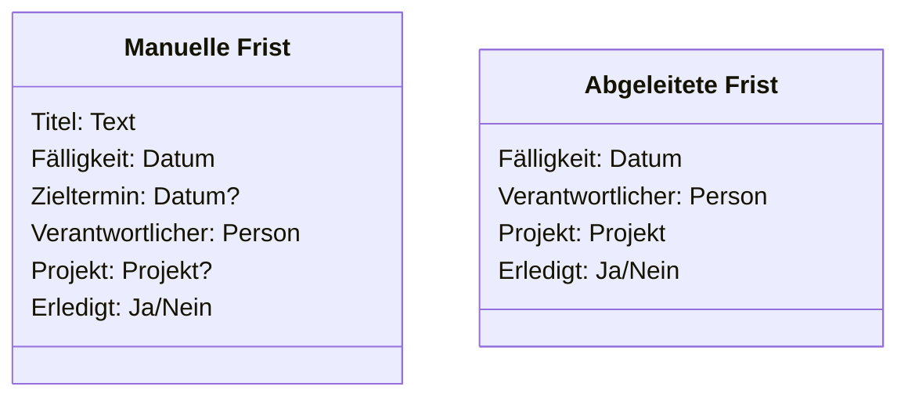

# fristen – Subdomain Map

```mermaid
classDiagram
    class ManuelleFrist["Manuelle Frist"] {
        Titel: Text
        Fälligkeit: Datum
        Zieltermin: Datum?
        Verantwortlicher: Person
        Projekt: Projekt?
        Erledigt: Ja/Nein
    }
    class AbgeleiteteFrist["Abgeleitete Frist"] {
        Fälligkeit: Datum
        Verantwortlicher: Person
        Projekt: Projekt
        Erledigt: Ja/Nein
    }
```
