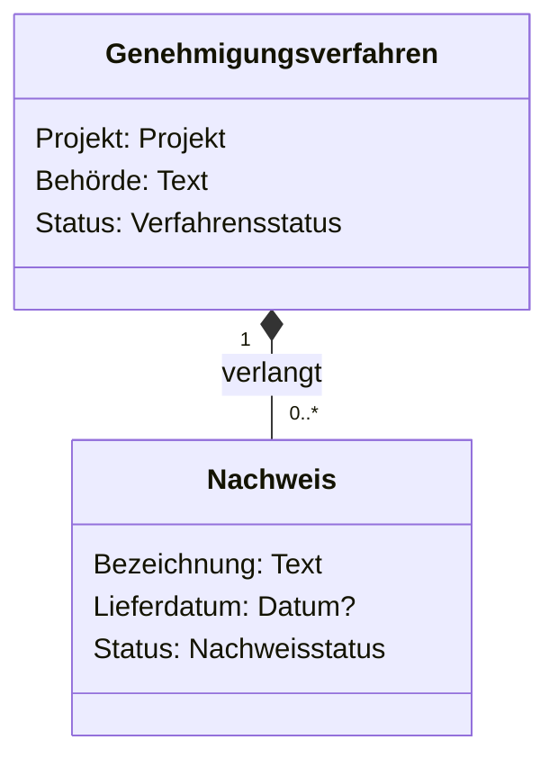

# genehmigung – Subdomain Map

```mermaid
classDiagram
    class Genehmigungsverfahren["Genehmigungsverfahren"] {
        Projekt: Projekt
        Behörde: Text
        Status: Verfahrensstatus
    }
    class Nachweis["Nachweis"] {
        Bezeichnung: Text
        Lieferdatum: Datum?
        Status: Nachweisstatus
    }
    Genehmigungsverfahren "1" *-- "0..*" Nachweis : verlangt
```
