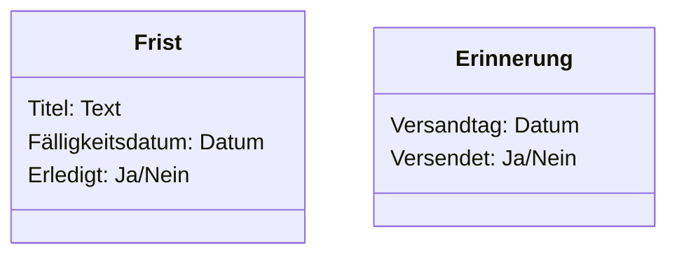

# fristen – Subdomain Map

```mermaid
classDiagram
    class Frist["Frist"] {
        Titel: Text
        Fälligkeitsdatum: Datum
        Erledigt: Ja/Nein
    }
    class Erinnerung["Erinnerung"] {
        Versandtag: Datum
        Versendet: Ja/Nein
    }
```
